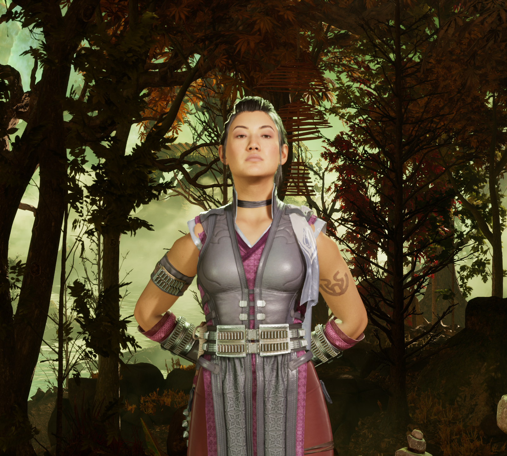
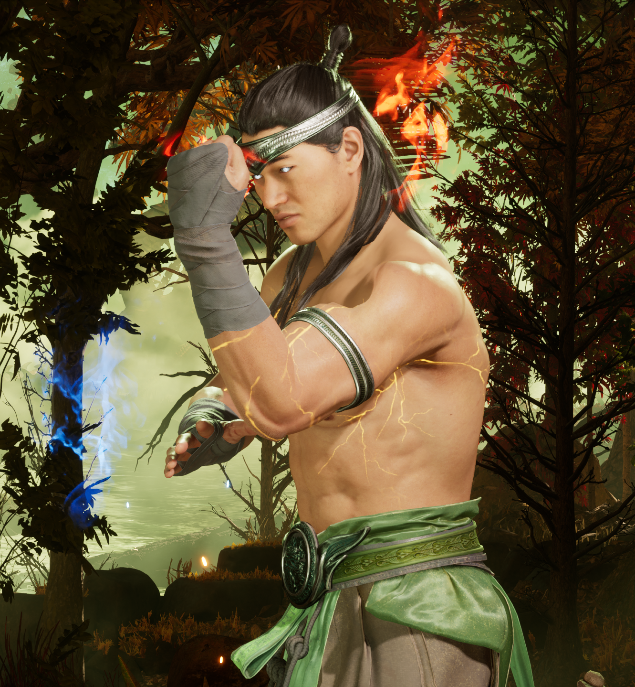
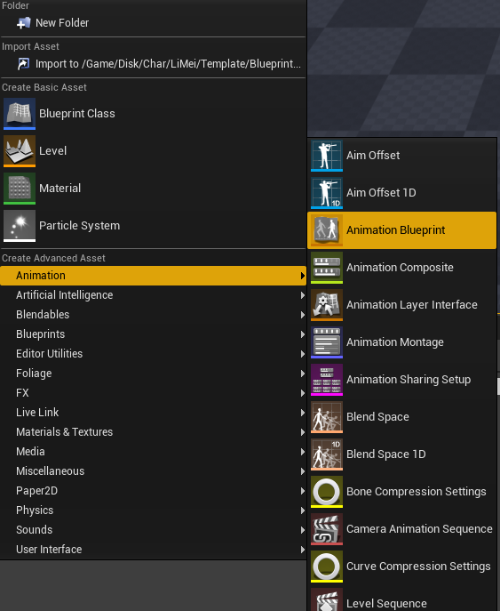

# Body deformations in certain poses

!!! note "This only fixes deformities caused by certain animations and will not fix a badly rigged/weighed mesh!"

Reimporting a body mesh into the game without applying the proper post process blueprint will show deformations in certain poses, such as here for Li Mei and Liu Kang:

|  |  |
|:---:|:---:|
| **Li Mei** | **Liu Kang** |

To fix this, you will need to assign the proper **post processing blueprint** to your mesh. Each character has specific post process blueprints located in their Template/Blueprint folder, ending with **_PostCR**

**Example for LiMei:**
**/Game/Disk/Char/LiMei/Template/Blueprint/BP_LiMei_PostCR**

To fix this, do the following:

1. Inside UE, mimic the folder structure leading to the _PostCR file and create a **dummy animation blueprint** like so:

	Select the skeleton for your character and click ok, you do not need to select a parent class.
	Name this anim blueprint the **exact same** as the one inside UModel/FModel.

2. Once you are done, navigate back to your imported mesh and open it. Scroll down and find this section:

	

3. Drag and drop the PostCR anim blueprint and your character will now animate properly