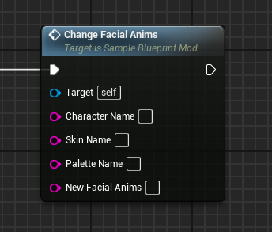
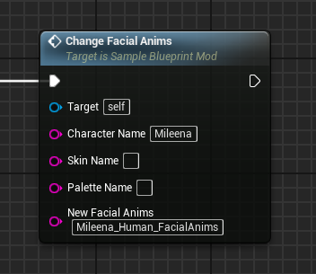

# ChangeFacialAnims event
This event replaces the target character's **in game** facial animations with the ones provided.

## Parameters

| Parameter | Type | Description |
|-----------|------|-------------|
| **`Character Name`** | `FString` | The name of the character you are targeting |
| **`Skin Name` (Optional)** | `FString` | The name of the skin you are targeting |
| **`Palette Name` (Optional)** | `FString` | The name of the palette you are targeting |
| **`New Facial Anims`** | `FString` | The name of the new facial animations MKAssetLibrary asset. A value of 'None' will completely remove the facial animations. |

## Example usage

!!! warning "Loading"
	The provided MKAssetLibrary asset must be first loaded through the [LoadMKAssetLibraries](../../LoadMKAssetLibraries/LoadMKAssetLibraries.md) event!