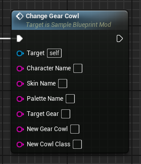
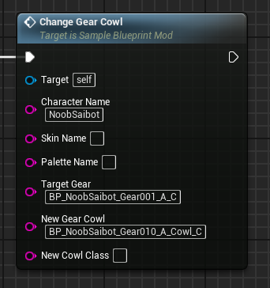
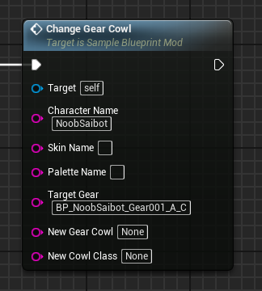

# ChangeGearCowl event
This event replaces the target character's 'cowl gear piece' with the provided one. This only applies to very specific characters, such as:

- Noob Saibot

## Parameters

| Parameter | Type | Description |
|-----------|------|-------------|
| **`Character Name`** | `FString` | The name of the character you are targeting |
| **`Skin Name` (Optional)** | `FString` | The name of the skin you are targeting |
| **`Palette Name` (Optional)** | `FString` | The name of the palette you are targeting |
| **`Target Gear`** | `FString` | The **blueprint** name of the targeted gear |
| **`New Gear Cowl`** | `FString` | The **blueprint** name of the new 'gear cowl' class. This blueprint class typically ends with the '_Cowl' extension. A value of 'None' will set this gear to nothing |
| **`New Cowl Class`** | `FString` | The **blueprint** name of the new 'cowl' class. A value of 'Default__BlueprintGeneratedClass' can be used as a placeholder to set this class to nothing (useful for removing the cowl entirely) |

!!! note "Gear cowl and cowl class"
	These two are distinctilly different assets! The cowl class only needs to be changed if you want to completely remove the cowl!

## Example usage
|  |  |
|:---:|:---:|
| **Example replacing their gear cowl** | **Example setting their gear cowl to nothing** |

!!! warning "Loading"
	Any new referenced blueprint class assets must be first loaded through the LoadAssets event! All BlueprintGeneratedClasses (starting with **BP_**) must be loaded and referenced by appending the **_C suffix** to their name!