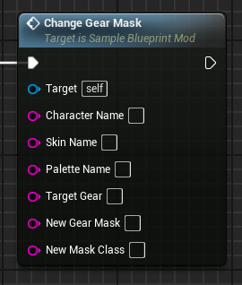
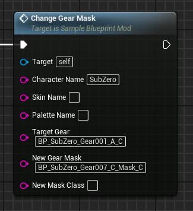
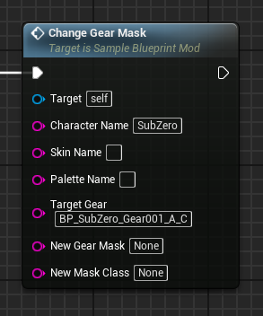
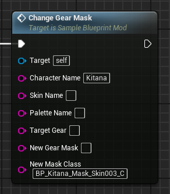
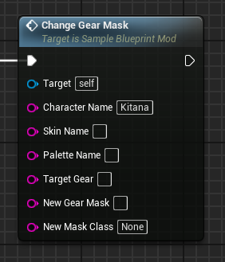

# ChangeGearMask event
This event replaces the target character's 'mask' (wether it'd be their gear piece or not) with the provided one. There are generally 2 ways this event can be used.

## Parameters

| Parameter | Type | Description |
|-----------|------|-------------|
| **`Character Name`** | `FString` | The name of the character you are targeting |
| **`Skin Name` (Optional)** | `FString` | The name of the skin you are targeting |
| **`Palette Name` (Optional)** | `FString` | The name of the palette you are targeting |
| **`Target Gear`** | `FString` | The **blueprint** name of the targeted gear |
| **`New Gear Mask`** | `FString` | The **blueprint** name of the new 'gear mask' class. This blueprint class typically ends with the '_Mask' extension. A value of 'None' will set this gear to nothing. |
| **`New Mask Class`** | `FString` | The **blueprint** name of the new 'mask' class. A value of 'None' will set this class to nothing (useful for removing the mask entirely) |

!!! note "Gear mask and mask class"
	These two are distinctilly different assets! The mask class only needs to be changed for characters for whom their gear is not their mask! Otherwise, this should only be changed if you want to completely remove the mask!

## Example usage

### Example on a character for whom the mask is their gear piece
|  |  |
|:---:|:---:|
| **Example replacing their gear mask** | **Example setting their gear mask to nothing** |

### Example on a character for whom the mask is not their gear piece
|  |  |
|:---:|:---:|
| **Example replacing their prop mask** | **Example setting their prop mask to nothing** |

!!! warning "Loading"
	Any new referenced blueprint class assets must be first loaded through the [LoadAssets](../../LoadAssets/LoadAssets.md) event!
	
	All BlueprintGeneratedClasses (starting with **BP_**) must be loaded and referenced by appending the **_C suffix** to their name!