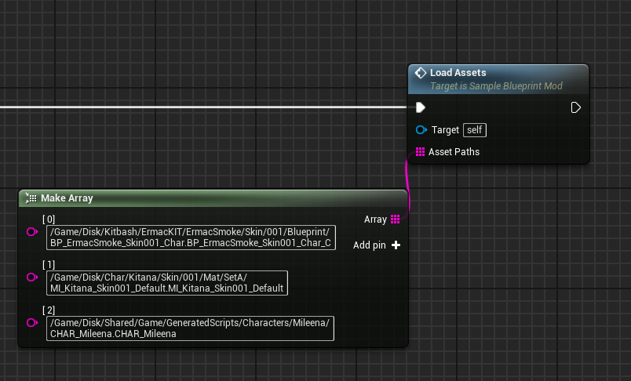

# LoadAssets event
This event loads any assets provided in the **AssetPaths** string array.

## Parameters

- AssetPaths: An array of strings containing the **full paths** to the assets to be loaded

## Example usage

!!! note "BlueprintGeneratedClasses"
	All BlueprintGeneratedClasses (starting with **BP_**) must be loaded by appending the **_C suffix** to their name!