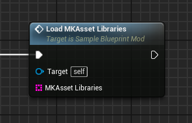
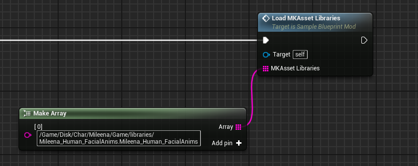

# LoadMKAssetLibraries event
This event loads any **MKAssetLibrary** asset provided in the **MKAsset Libraries** string array. This event is very similar to the **LoadAssets** event, however it is meant to be used specifically with **MKAssetLibrary** assets, since they require extra handling.

!!! note "MKAssetLibrary"
	Most MKAssetLibrary assets are found in a character's folder, inside **/Game/Libraries/**

## Parameters

| Parameter | Type | Description |
|-----------|------|-------------|
| **`MKAsset Libraries`** | `TArray` | An array of strings containing the **full paths** to the MKAssetLibrary assets to be loaded. |

## Example usage
