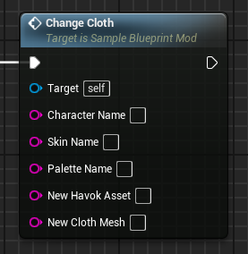
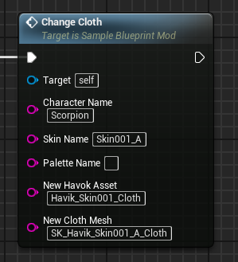

# ChangeCloth event
This event replaces the target character's cloth mesh and havok asset (physics) with the provided values.

## Parameters

| Parameter | Type | Description |
|-----------|------|-------------|
| **`CharacterName`** | `string` | The name of the character you are targeting |
| **`SkinName` (Optional)** | `string` | The name of the skin you are targeting |
| **`PaletteName` (Optional)** | `string` | The name of the palette you are targeting |
| **`NewHavokAsset`** | `string` | The name of the new havok asset |
| **`NewClothMesh`** | `string` | The name of the new cloth mesh |

## Example usage

!!! warning "Loading"
	Any new referenced cloth mesh or havok asset must be first loaded through the LoadAssets event!

!!! note "Names"
	All character, skin or palette names must be written as they are in the game files!