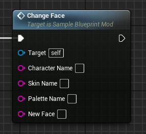
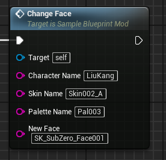

# ChangeFace event
This event replaces the target character's face with the provided mesh.

## Parameters

| Parameter | Type | Description |
|-----------|------|-------------|
| **`CharacterName`** | `string` | The name of the character you are targeting |
| **`SkinName` (Optional)** | `string` | The name of the skin you are targeting |
| **`PaletteName` (Optional)** | `string` | The name of the palette you are targeting |
| **`NewFace`** | `string` | The name of the new face mesh |

## Example usage

!!! warning "Loading"
	Any new referenced face must be first loaded through the LoadAssets event!

!!! note "Names"
	All character, skin or palette names must be written as they are in the game files!