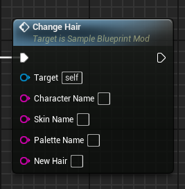
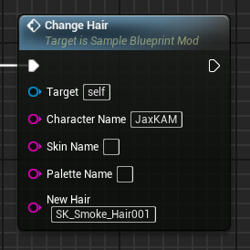

# ChangeHair event
This event replaces the target character's hair with the provided mesh.

## Parameters

| Parameter | Type | Description |
|-----------|------|-------------|
| **`Character Name`** | `FString` | The name of the character you are targeting |
| **`Skin Name` (Optional)** | `FString` | The name of the skin you are targeting |
| **`Palette Name` (Optional)** | `FString` | The name of the palette you are targeting |
| **`New Hair`** | `FString` | The name of the new hair mesh. A value of 'None' will completely remove the mesh. |

## Example usage

!!! warning "Loading"
	Any new referenced hair must be first loaded through the [LoadAssets](../../LoadAssets/LoadAssets.md) event!