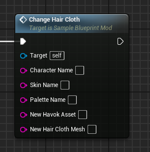
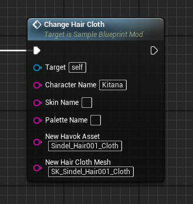

# ChangeHairCloth event
This event replaces the target character's hair cloth mesh and havok asset (physics) with the provided values.

## Parameters

| Parameter | Type | Description |
|-----------|------|-------------|
| **`Character Name`** | `FString` | The name of the character you are targeting |
| **`Skin Name` (Optional)** | `FString` | The name of the skin you are targeting |
| **`Palette Name` (Optional)** | `FString` | The name of the palette you are targeting |
| **`New Havok Asset`** | `FString` | The name of the new havok asset. A value of 'None' will completely remove the havok asset. |
| **`New Hair Cloth Mesh`** | `FString` | The name of the new hair cloth mesh. A value of 'None' will completely remove the mesh. |

## Example usage

!!! warning "Loading"
	Any new referenced hair cloth mesh or havok asset must be first loaded through the [LoadAssets](../../LoadAssets/LoadAssets.md) event!