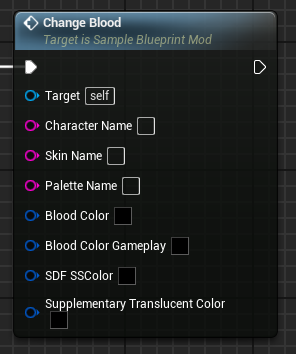
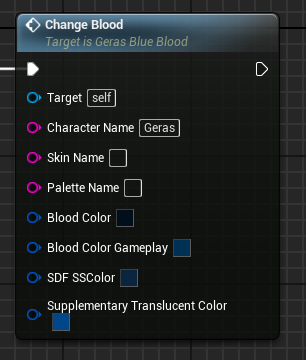

# ChangeBlood event
This event replaces the target character's blood colour properties with the provided ones. There are 4 values that comprise the colour of a character's blood (including dism flesh colour)

## Parameters

| Parameter | Type | Description |
|-----------|------|-------------|
| **`Character Name`** | `FString` | The name of the character you are targeting |
| **`Skin Name` (Optional)** | `FString` | The name of the skin you are targeting |
| **`Palette Name` (Optional)** | `FString` | The name of the palette you are targeting |
| **`Blood Color`** | `Linear Color` | The main colour value affecting blood |
| **`Blood Color Gameplay`** | `Linear Color` | A secondary colour value mainly applying to the colour of the blood liquid during gameplay |
| **`SDF SSColor`** | `Linear Color` | A colour value mainly affecting the dism flesh colour |
| **`Supplementary Translucent Color`** | `Linear Color` | A colour with some impact on the translucency of blood (supposedly) |

## Example usage
