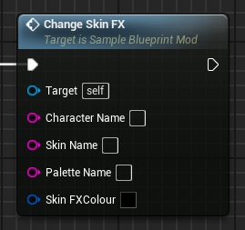
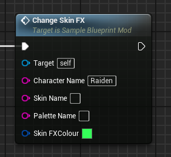

# ChangeSkinFX event
This event replaces the target character's SkinFX colour property with the provided one. The name might sound ambiguous, but this mainly applies to Raiden's lightning colour.

## Parameters

| Parameter | Type | Description |
|-----------|------|-------------|
| **`Character Name`** | `FString` | The name of the character you are targeting |
| **`Skin Name` (Optional)** | `FString` | The name of the skin you are targeting |
| **`Palette Name` (Optional)** | `FString` | The name of the palette you are targeting |
| **`SkinFX Colour`** | `Linear Color` | The new value for the SkinFX colour |

## Example usage
