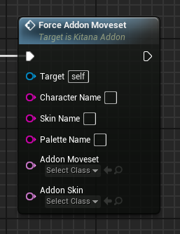
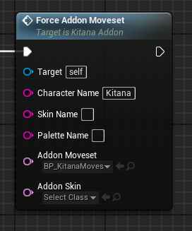

# ForceAddonMoveset event
This event adds moveset addon compatibility to the specified character. This enables you to mix two movesets for one character (the main moveset and the addon one).

## Parameters

| Parameter | Type | Description |
|-----------|------|-------------|
| **`Character Name`** | `FString` | The name of the character you are targeting |
| **`Skin Name` (Optional)** | `FString` | The name of the skin you are targeting |
| **`Palette Name` (Optional)** | `FString` | The name of the palette you are targeting |
| **`Addon Moveset`** | `TSoftClass Ptr` | The soft reference to a moveset template blueprint considered the "addon moveset" |
| **`Addon Skin` (Optional)** | `TSoftClass Ptr` | The soft reference to a skin blueprint applied as an "addon skin" (Overrides the original skin) |

!!! warning "Moveset template blueprint"
	This event requires the usage of the MK12 sample project, a guide is available here: (to do)!

## Example usage
