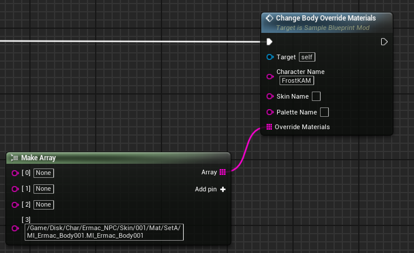

# ChangeBodyOverrideMaterials event
This event replaces the target character's body **override** materials with the provided ones. This typically applies to seasonal skins.

## Parameters

| Parameter | Type | Description |
|-----------|------|-------------|
| **`Character Name`** | `FString` | The name of the character you are targeting |
| **`Skin Name` (Optional)** | `FString` | The name of the skin you are targeting |
| **`Palette Name` (Optional)** | `FString` | The name of the palette you are targeting |
| **`Override Materials`** | `TArray` | An array of strings containing the name of the new override materials. Order defines material position within the mesh. A value of 'None' can be used in between materials. |

## Example usage
|  |  |
|:---:|:---:|
| **Example** | **Example with empty array** |

!!! warning "Loading"
	Any new referenced materials must be first loaded through the LoadAssets event!