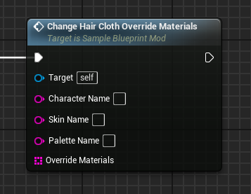
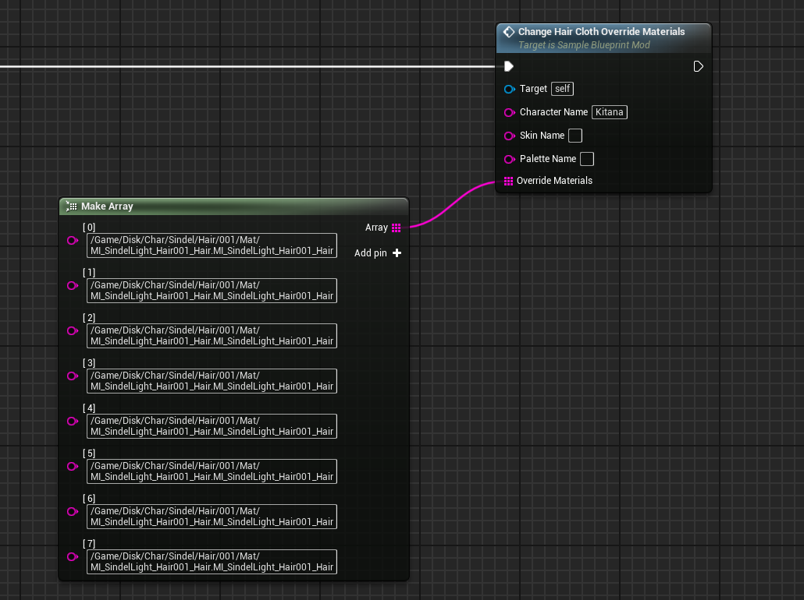

# ChangeHairClothOverrideMaterials event
This event replaces the target character's hair cloth **override** materials with the provided ones. This typically applies to seasonal skins.

## Parameters

| Parameter | Type | Description |
|-----------|------|-------------|
| **`Character Name`** | `FString` | The name of the character you are targeting |
| **`Skin Name` (Optional)** | `FString` | The name of the skin you are targeting |
| **`Palette Name` (Optional)** | `FString` | The name of the palette you are targeting |
| **`Override Materials`** | `TArray` | An array of strings containing the name of the new override materials. Order defines material position within the mesh. A value of 'None' can be used in between materials. |

!!! note "Empty array"
	An empty array will clear any existing override materials! (Useful for seasonal skins)

## Example usage

!!! warning "Loading"
	Any new referenced materials must be first loaded through the [LoadAssets](../../LoadAssets/LoadAssets.md) event!