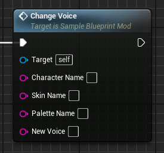
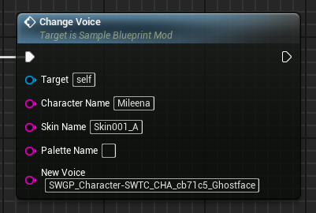

# ChangeVoice event
This event replaces the target character's voice asset with the provided one.

## Parameters

| Parameter | Type | Description |
|-----------|------|-------------|
| **`Character Name`** | `FString` | The name of the character you are targeting |
| **`Skin Name` (Optional)** | `FString` | The name of the skin you are targeting |
| **`Palette Name` (Optional)** | `FString` | The name of the palette you are targeting |
| **`New Voice`** | `FString` | The name of the new voice asset |

## Example usage

!!! warning "Loading"
	Any new referenced grunts asset must be first loaded through the LoadAssets event!
	
	Tip: Voice assets are located in the "/Game/WwiseAudio/Switches/SWITCHES_All/SWGP_Character/" folder